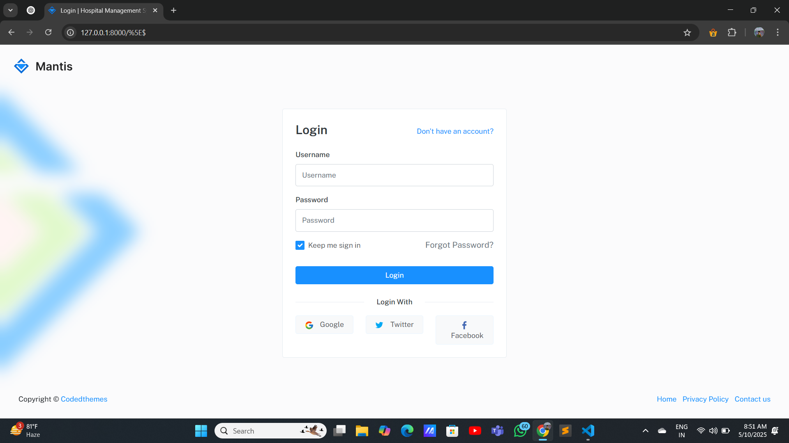
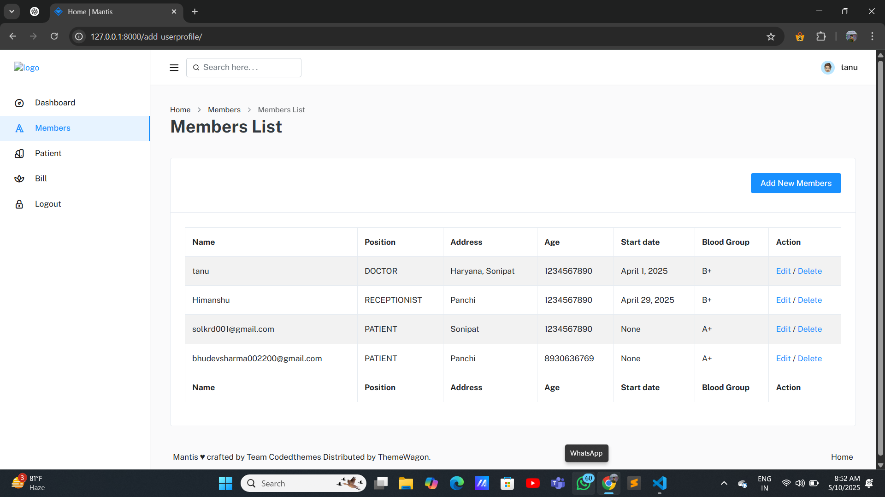
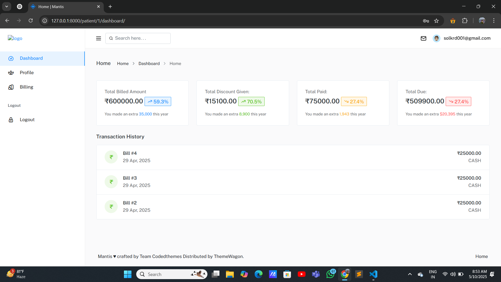
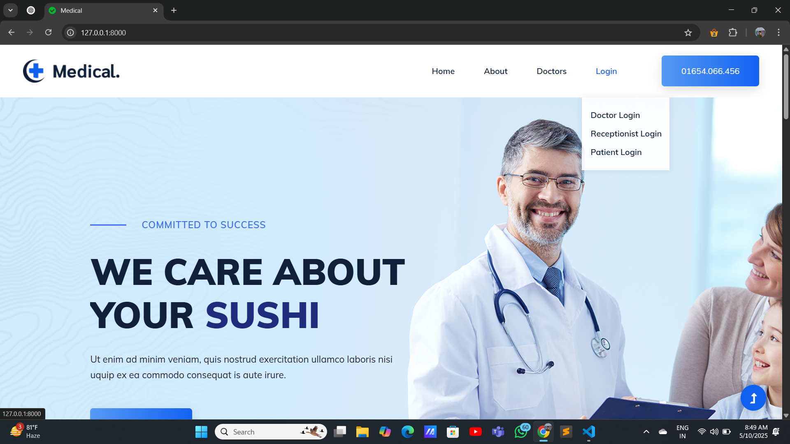
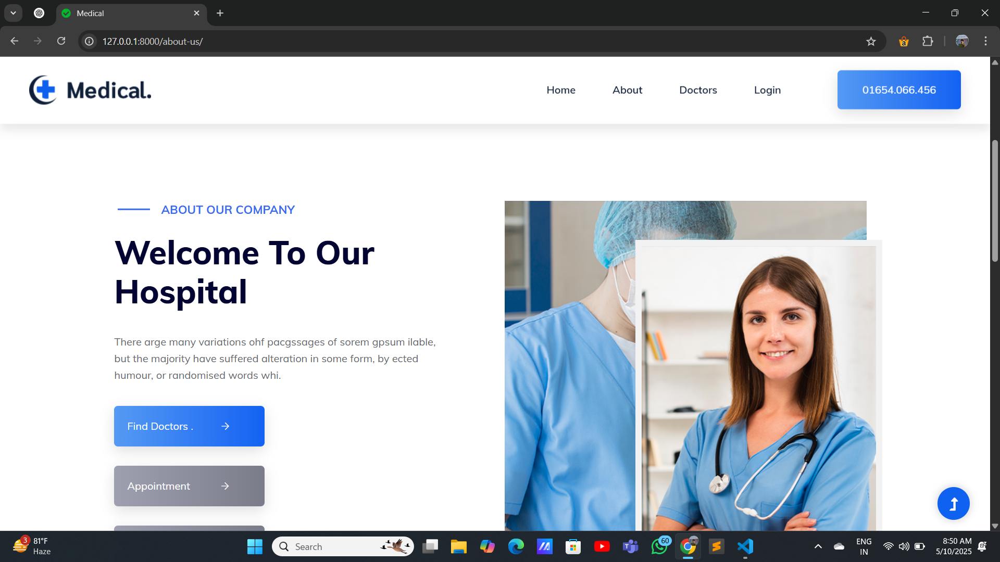
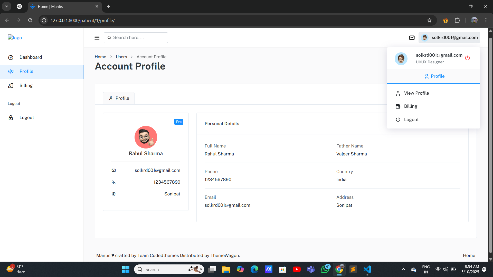
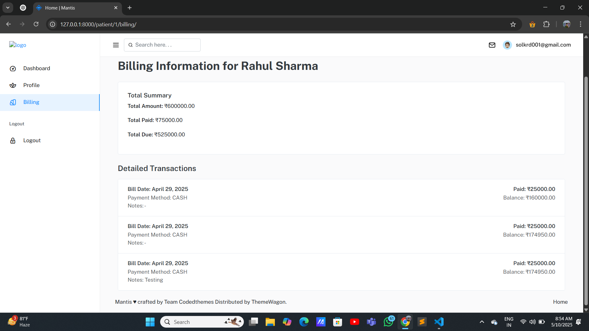

# 🏥 Healthcare - Hospital Management System
Welcome to Healthcare, a comprehensive Hospital Management System built using Python. This system facilitates smooth operations in a hospital setting with dedicated login systems for Admin, Receptionist, and Patients. It also includes essential pages like About Us and Doctors for an informative and professional experience.

# 📸 Demo Screenshots
| Admin Login                            | Receptionist Dashboard                                       | Patient Portal                               |
| -------------------------------------- | ------------------------------------------------------------ | -------------------------------------------- |
|  |  |  |

## ✨ Features
# 🔐 Multi-User Login System
- Admin Login
  - Manage doctors, staff, and hospital operations.
  - View statistics and generate reports.
- Receptionist Login
  - Register new patients.
  - Schedule and manage appointments.
- Patient Login
  - View personal medical history.
  - Book or cancel appointments.

| Home Page                            | Doctor Page                                       | About Page                               |
| -------------------------------------- | ------------------------------------------------------------ | -------------------------------------------- |
|  |  |  |


| Patient Dashboard                            | Patient Profile                                       | Patient Bill                               |
| -------------------------------------- | ------------------------------------------------------------ | -------------------------------------------- |
|  |  |  |


# 🩺 Doctors Page
 - Showcases hospital doctors with their specialties and experience.
 - User-friendly and visually engaging layout.
# 📄 About Us Page
 - Provides hospital background, mission, and values.
 - Highlights services and achievements.\
   
# 🛠️ Tech Stack
  - Language: Python
  - GUI Library: Tkinter / PyQt (Replace with your actual one)
  - Database: SQLite / MySQL (Specify your database here)
  - IDE: (Optional) e.g., PyCharm, VSCode

## 🚀 Getting Started
1. Clone the Repository
   ```bash
   git clone https://github.com/Himanshu1529/Healthcare-Hospital-Management-System.git
   cd Healthcare-Hospital-Management-System
   ```
2. Install Requirements
   If you're using any dependencies (e.g., pip install mysql-connector-python), mention them here.
   ```bash
    pip install -r requirements.txt
   ```
3. Run the Application
   ```bash
   py manage.py runserver
          OR
   python manage.py runserver
   ```
## 📂 Project Structure
```bash
Healthcare-HMS/
│
├── images/                   # Screenshots and UI images
├── admin_login.py
├── receptionist_login.py
├── patient_login.py
├── doctors.py
├── about_us.py
├── database/
│   └── hospital.db           # Database file (or your SQL scripts)
├── assets/                   # Icons, logos, etc.
├── README.md
└── main.py
```
## 🙌 Contributors

* [Himanshu Sharma](https://himanshusharma01.vercel.app) – Project Developer

---

## 📄 License

This project is licensed under the MIT License - see the [LICENSE](LICENSE) file for details.

---


